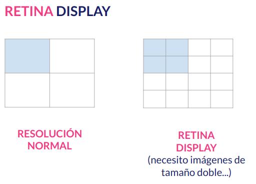

## II.2 Imágenes responsivas

Las imágenes son un elementos **fundamental** de todas las páginas y representan una gran parte del **pseo** de la misma. Esta situación plantea ciertos **retos** a la hora de hacer **\*diseño responsivo**.

Estos retos son principalmente dos:

- Retos a nivel de **optimización** de la página web.
- Retos a la hora de **diseñar** la página.

### Optimización de Imágenes en el Diseño Responsivo

Cuando nos referimos a optimizar el uso de las imágenes nos referimos a:

- Consumir el menor ancho de banda posible.
- Elegir la versión de una misma imagen más adecuada para la resolución.

En este proceso de optimización debemos tener en cuenta:

- Ancho del dispositivo.
- Dimensiones de la imagen.
- Resolución de la imagen (en especial en los dispositivos RETINA DISPLAY)



Este tipo de dispositivos tiene una densidad de pixels superior a la normal. En la imagen su muestra la explicación para dispositivos con densidad 2x. En estos casos para que las imágenes se muestren bien tendrán que ser de tamaño doble.

### Optimización. Imágenes SVG

Para solucionar este tipo de problemas lo más fácil es usar imágenes **SVG** que son gráficos vectoriales que escalan y encogen sin perder resolución.

El problema es que no siempre disponemos de gráficos SVG.

### Optimización. Imágenes PNG/GIF/JPEG

En estos casos, si no nos importa la optimización es suficiente con usar una imagen de gran resolución y dimensiones y acotarla dentro de un contenedor.

Por ejemplo:

```html
<div></div>
```

```css
div {
  /* dimensiones deseadas */
}

img {
  max-width: XXXXXpx;
  width: 100%;
}
```

Pero sin embargo, si nos importa la optimización utilzaremos los atributos **scrset** y/o **sizes** de la imagen que queremos mostrar.

Por ejemplo:

```html
<!-- Considerando resolución: -->
<div class="container">
  
</div>

<!-- Considerando dimensiones: -->
<div class="container">
  
</div>
```

### Diseño _"ART-DIRECTOR"_

La técnica de diseño responsivo **Art Director** consiste en elegir una u otra imagen utilizando la etiqueta **source** dentro la etiqueta **picture** y sus atributos **srcset** para indicar la imagen y **media** que funciona de manera similar a una media query.

Se ve muy claro con un ejemplo:

```html
<div class="art">
  <picture>
    <source media="(min-width: 576px)" srcset="img/big-art.jpg" />
    <source media="(max-width: 575px)" srcset="img/small-art.jpg" />
    
    <!-- En caso de no soportar picture -->
  </picture>
</div>
```

Normalmente este diseño consiste en fotos que se acercan al objeto importante.

Al final, en casos reales siempre hay que combinar ambas técnicas y probar, en la medida de lo posible, en dispositivos reales, incluidos móviles con Retina Display.

Curso desarrollado por [pekechis](http://github.com/pekechis) para [OpenWebinars](https://openwebinars.net/)
